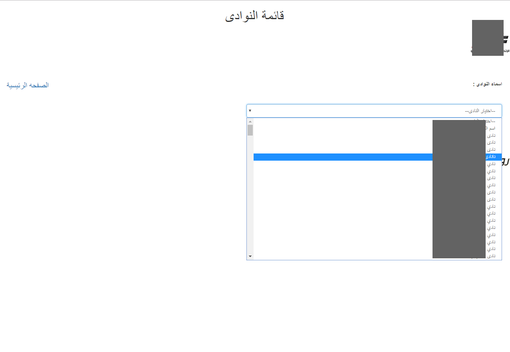
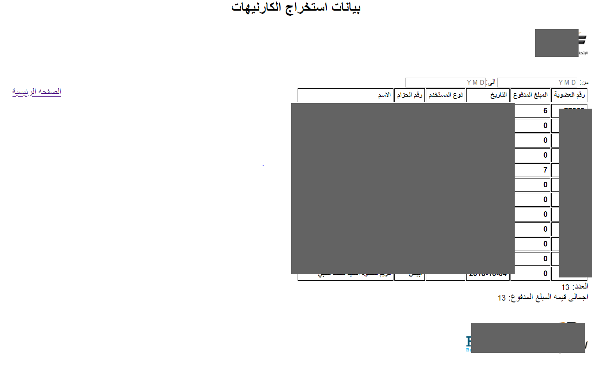
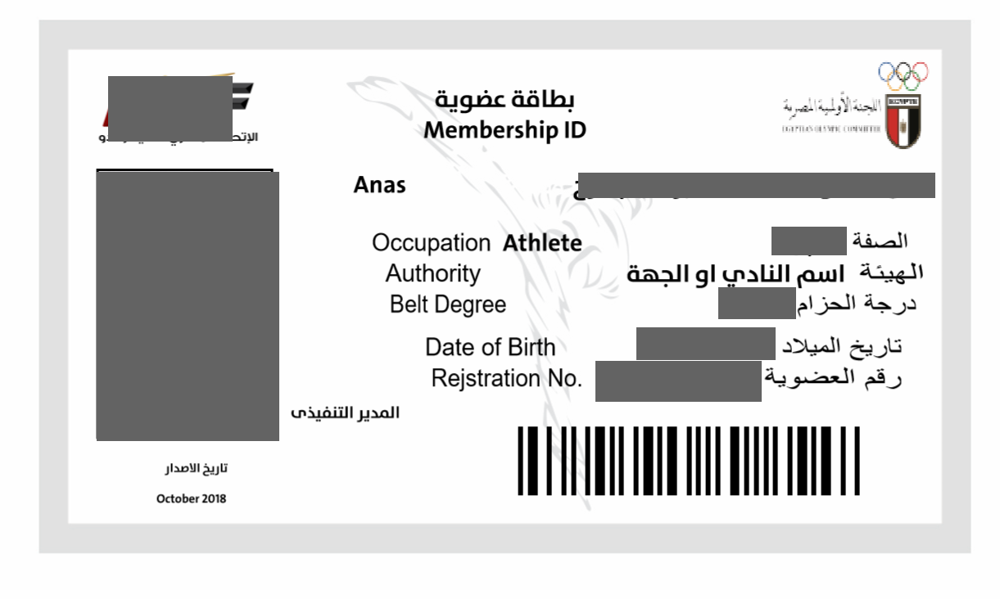

# Id-Card-System-PHP
display drop down list of clubs when select club get all players and create one pdf for each player then download all cards of player with zip file or each player alone . using (php , ajax , JS , JQUARY , BOOTESTRAP )

# some screenshot from project 

